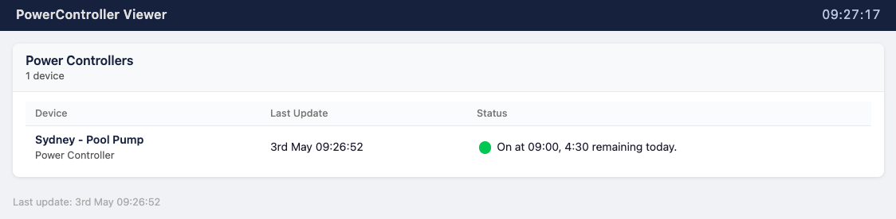

# PowerControllerViewer Web Interface

PowerControllerViewer is a simple Python web app used to display the current status and recent history from one or more PowerController and/or LightingControl installations.

Before using this app, please install and run at least one instance of one of these apps, available from [https://github.com/Spello-Consulting/](https://github.com/Spello-Consulting/).

## Installation and Configuration Guide

The pages below will walk you through installing, configuring and running the PowerControllerViewer application.

 - [Installation and Getting Started](installation/index.md)
 - [Configuration Guide](configuration/index.md)
 - [Running the App](running.md)
 - [Production Deployment](prod_deployment.md)
 - [Remote Access with Tailscale](tailscale.md)
 - [Upgrading an existing installation](upgrading.md)
