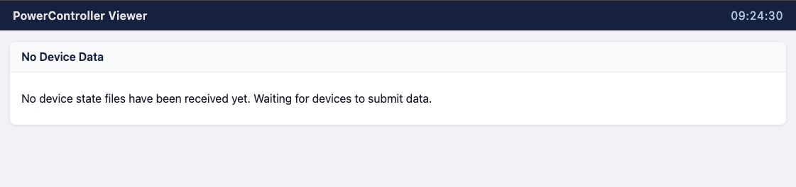

# Running and testing the app

By this stage you should have:

✅ Installed the [prerequisites](installation/prerequisites.md)<br>
✅ Installed the [PowerControllerViewer application](installation/install_app.md)<br>
✅ Configured the [application](configuration/index.md)

For the steps below, we assume that:

* Your host is using IP _192.168.1.20_
* You have configured the web app to bind to port _8000_
* You haven't set up an AccessKey

## Launching the app

Use the launch script. It uses UV to create the virtual environment and install the necessary Python packages:

```bash
./scripts/launch.sh
```

Go to `http://192.168.1.20:8000/home` to view the web page. Until a sending app has posted some state, you should see something like this:



## Connecting a PowerController or LightingControl instance

Edit the _config.yaml_ file of the PowerController or LightingControl instance. In the section for the viewer website, enter the details of this web app:

```yaml
  WebsiteBaseURL: http://192.168.1.20:8000
  WebsiteAccessKey: <Optional access key>
```

Now refresh the web app page in your browser. You should see something like this:


## Other pages

* `/system` shows platform information and host metrics, plus the number of state data files loaded.
* `/config` shows the active configuration file.

# Next Step >> [Production Deployment](prod_deployment.md)
